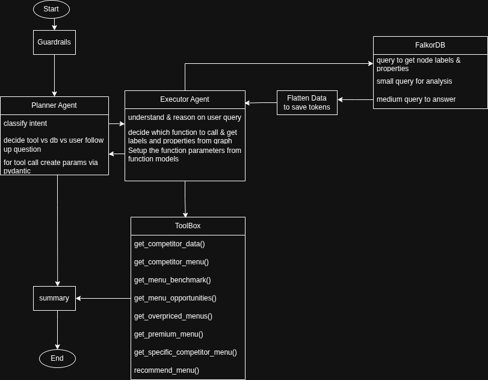
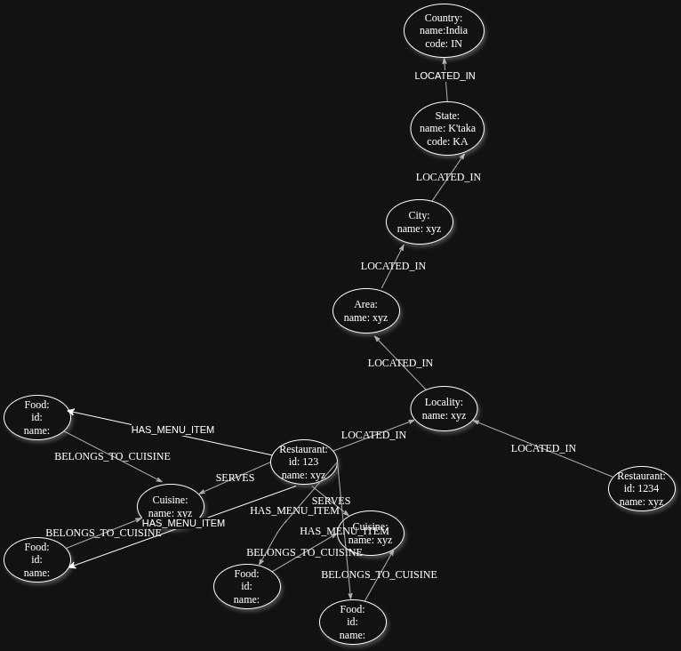
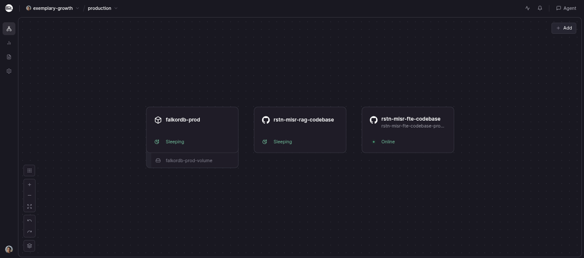
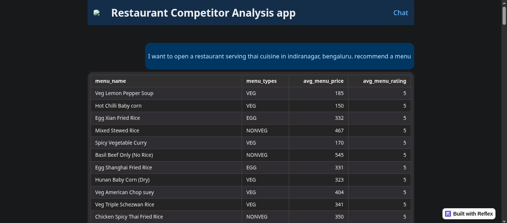

# 🍽️ Restaurant Menu Competitor Intelligence — AI-Powered Analysis Chatbot

> A production-deployed, agentic AI system for restaurant menu and competitor analysis across localities, areas, and cities. Built on a graph-native knowledge base with a multi-agent reasoning pipeline.

[](https://rstn-misr-fte-codebase-production.up.railway.app/) 
[](https://railway.app)

---

## 📌 Overview

This application allows restaurant owners and food entrepreneurs to query competitor menus, benchmark pricing, discover cuisine gaps, and surface market opportunities — all through a conversational chatbot interface.

The system is built as a **production monorepo with microservice architecture**, combining a graph database knowledge base, an agentic AI reasoning pipeline, and a scalable ETL pipeline that ingested data from **37,000+ restaurant websites**.

---

## 🚀 Live Demo

🌐 **[https://rstn-misr-fte-codebase-production.up.railway.app/](https://rstn-misr-fte-codebase-production.up.railway.app/)**

Please use following template queries:
```text
Tell me about my competitors in __area_name__, __bangalore-bengaluru__ who serve __cuisine_name__ cuisine

Give me the menu of my competitors in __area_name__, __bangalore-bengaluru__ that serve __cuisine_name__

I want to benchmark __food_name__, a __cuisine_name__ dish with other restaurants serving it in __area_name__, __bangalore-bengaluru__

Tell me about the menu opportunities that are available to open a restaurant in __area_name__ that serve __cuisine_name__ cuisine

What __cuisine_name__ menu items are overpriced and not well liked by people in __area_name__, __bangalore-bengaluru__

What __cuisine_name__ menu items are considered premium and well liked by people in __area_name__, __bangalore-bengaluru__

Give me the full menu of __restaurant_name__ in __area_name__, __bangalore-bengaluru__

I want to open a restaurant serving __cuisine_name__ cuisine in __area_name__, __bangalore-bengaluru__. recommend a menu
```
---

## 🏗️ System Architecture

The system is composed of four independently deployable services orchestrated via Docker Compose:

```
┌─────────────────────────────────────────────────────────┐
│                    Client (Browser)                     │
└──────────────────────┬──────────────────────────────────┘
                       │
┌──────────────────────▼──────────────────────────────────┐
│              Frontend — Reflex (Python)                 │
│         Reactive full-stack web framework               │
└──────────────────────┬──────────────────────────────────┘
                       │  REST / WebSocket
┌──────────────────────▼────────────────────────────────────────────┐
│           RAG / Agentic Backend — FastAPI                         │
│   Planner Agent → Executor Agent → ToolBox → Gen Agebt → Summary  │
│          Groq LLMs · Pydantic · LangChain                         │
└────────┬──────────────────────────────────────────────────────────┘
         │                                             
┌────────▼──────┐    ┌─────────────────┐    ┌─────────────────┐
│   FalkorDB    │    │    MongoDB      │    │    Redis        │
│ Graph DB      │    │  Raw Data Store │    │  Scrape Queue   │
│ Cypher Queries│    │  JSON Documents │    │                 │
└───────────────┘    └─────────────────┘    └─────────────────┘
         ▲
┌────────┴────────────────────────────────────────────────────┐
│                  ETL Pipeline Service                       │
│     Scraper → Pydantic Parser → Graph Loader                │
│  Horizontal scaling (Docker) · Vertical scaling (Threading) │
└─────────────────────────────────────────────────────────────┘
```

---

## 🤖 Agentic AI Pipeline

This is **not a RAG system**. Rather than embedding-based retrieval, it uses a structured **multi-agent reasoning pipeline** powered by Groq-hosted LLMs.

### Agent Flow



**Design rationale:**
- ~90% of queries are served via **hard-coded Cypher queries** in the ToolBox — reliable, fast, token-efficient
- A fallback path exists for LLM-generated Cypher queries (currently disabled due to strict token limits)
- **Two separate LLMs** are used deliberately: a larger model for high-quality intent reasoning and a smaller, faster model for tool-call execution — balancing quality and latency

---

## 🕸️ Graph Database Design (FalkorDB)

FalkorDB was chosen over a vector database because the domain is **inherently relational and hierarchical** — not semantic. Restaurant data has a strict geographic and categorical structure that maps naturally to a property graph.

### Graph Ontology

The ontology was designed and implemented from scratch:

```cypher
(country:Country)-[:HAS_STATE]→(state:State)-[:HAS_CITY]→(city:City)
    -[:HAS_AREA]→(area:Area)-[:HAS_LOCALITY]→(locality:Locality)
    -[:HAS_RESTAURANT]→(rstn:Restaurant)

(rstn:Restaurant)-[:HAS_MENU]→(menu:Menu)
(rstn:Restaurant)-[:SERVES]→(cuisine:MainCuisine)
(menu:Menu)-[:BELONGS_TO]→(cuisine:MainCuisine)
```

**Node details:**
```text
Country {ids, name, iso_code, coords, boundingbox}
State {ids, name, iso_code, coords, boundingbox}
City {ids, name, coords, boundingbox, old_name}
Area {ids, name}
Locality {ids, name}
Restaurant {ids, name, city, area, locality, cuisines, rating, address, coords, chain, city_id}
Menu {name, category, description, price, rating, types, cuisine}
MainCuisine {cuis}
```

This structure enables powerful graph traversal queries — e.g., *"find all restaurants in a locality that serve a specific cuisine and have menu items priced above the area average"* — which would be expensive or impossible to model cleanly in a relational or vector database.



**Why FalkorDB specifically:**
- Free and open-source (FOSS)
- Redis-compatible protocol — fast in-process graph queries
- Mature Cypher query support
- Persistent volume support for production deployment

---

## ⚙️ ETL Pipeline

### Data Source
- Scraped **37,000+ restaurant websites** for Bangalore
- Source data was in the form of **deeply nested JSON** structures

### Parsing
- Built custom **Pydantic BaseModels** to parse, validate, and normalize the raw nested JSON into clean graph-ready entities
- Manually curated geographic metadata for **758 Indian cities** including names, historical names, and unique **OpenStreetMap IDs**

### Loading Performance

| Version | Load Time (Bangalore dataset) |
|---------|-------------------------------|
| Initial implementation | ~26 minutes |
| After optimisation | ~7 minutes |

**Optimisation techniques:**
- **Vertical scaling**: Multi-threaded graph loading using Python `ThreadPoolExecutor` — parallelised write operations to FalkorDB
- **Horizontal scaling**: ETL packaged as a Docker image, allowing multiple scraper instances to run concurrently across different cities

### Scalability Design
The ETL is architected for national-scale expansion — new cities can be onboarded by adding their OSM ID to the cities config and spinning up additional scraper containers.

---

## 🛠️ Tech Stack

| Layer | Technology |
|-------|------------|
| **Frontend** | Reflex (Python-native reactive web framework) |
| **Backend** | FastAPI, LangGraph, Pydantic |
| **LLMs** | Groq API — `llama-3.1-70b-versatile` (planner), `llama-3.3-8b` (executor) |
| **Graph DB** | FalkorDB (Cypher, Redis-compatible) |
| **Document Store** | MongoDB |
| **Cache** | Redis |
| **ETL** | Custom Python — crawl4ai, Pydantic, ThreadPoolExecutor |
| **Containerisation** | Docker, Docker Compose |
| **Deployment** | Railway (production) |

---

## 📁 Repository Structure

```
ETL
├── app.py
├── devl.Dockerfile
├── main.py
├── prod.Dockerfile
├── pyproject.toml
├── railway.json
├── README.md
├── Src
│   ├── Components/
│   ├── Config/
│   ├── Constants/
│   ├── Loader/
│   │   ├── Cyphers/
│   ├── Scraper/
│   ├── Seeder/
│   ├── Utils/
└── uv.lock

RAG
├── app.py
├── devl.Dockerfile
├── main.py
├── prod.Dockerfile
├── pyproject.toml
├── railway.json
├── README.md
├── Src
│   ├── Components/
│   ├── Config/
│   ├── Constants/
│   └── Utils/
└── uv.lock

Frontend
├── assets/
├── Caddyfile
├── devl.Dockerfile
├── FE_Chat
│   ├── Chat/
│   ├── FE_Chat.py
│   ├── GUI/
│   ├── Nav/
│   └── Utils/
├── main.py
├── prod.Dockerfile
├── pyproject.toml
├── railway.json
├── README.md
├── requirements.txt
├── run_app.sh
├── rxconfig.py
└── uv.lock
```

---

## 🚢 Deployment

Services are deployed on **Railway** in a production environment:

| Service | Status |
|---------|--------|
| `rstn-misr-fte-codebase` (Frontend) | 🟢 Online |
| `rstn-misr-rag-codebase` (Backend) | 💤 Sleeping (cold start) |
| `falkordb-prod` (Graph DB) | 💤 Sleeping (cold start) |





> **Note:** The RAG backend and FalkorDB are set to sleep when idle to manage hosting costs. Expect a 20 - 40 second cold start on first query. ETL, MongoDB and Redis arent deployed to save cost.

---

## 💡 Key Engineering Decisions

**Graph DB over Vector DB** — The problem is structural, not semantic. A graph traversal over `(Locality)→(Restaurant)→(Menu)` is precise and fast; embeddings would add noise and latency without benefit.

**Hard-coded Cypher over LLM-generated queries** — LLM-generated Cypher is non-deterministic and risks returning large uncontrolled result sets that blow token limits. Hard-coded queries are reliable, auditable, and fast.

**Two-LLM pipeline** — Separating reasoning (large model) from tool execution (small model) gives quality where it matters and speed where it doesn't.

**Pydantic-first ETL** — Using Pydantic BaseModels as the parsing contract ensured type safety and made schema evolution manageable across 37,000+ source documents.


---
